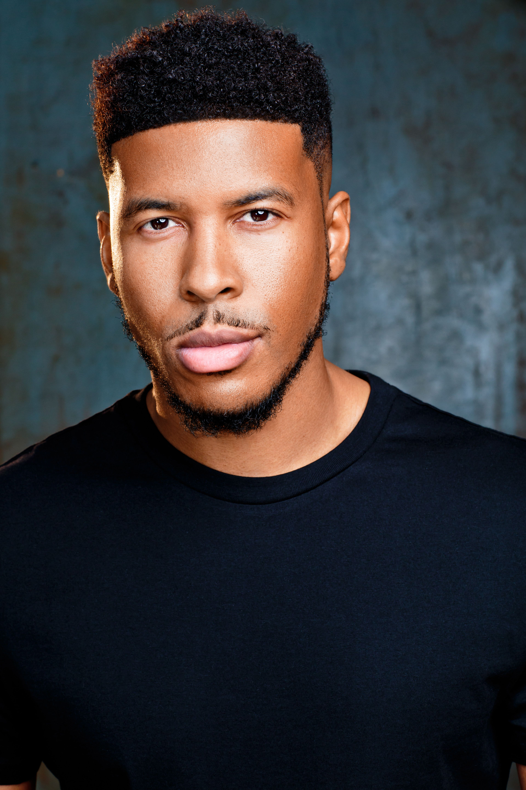
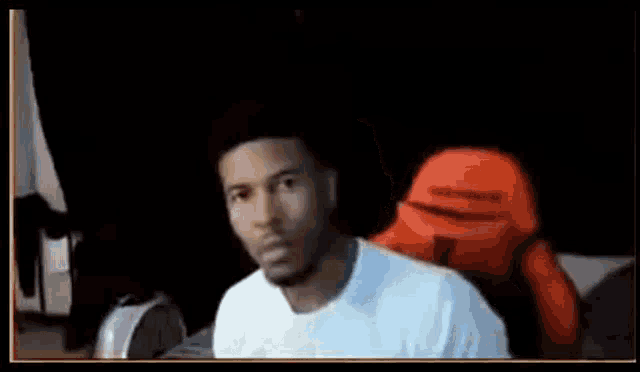

## Dean Blog - CSSE 

##   - A portrait of myself.

This is my first edit on my home page.

I was able to do this by following the instructions on the CSSE website and a little bit of experimenting.

I learned that if you want to put in big text, use two ##'s. I also now know that if you want to add a link, you put the title in brackets and the link in parentheses. [MyConnect](https://poway.instructure.com)

This is it so far. Yessirski.

## Freeform Image

